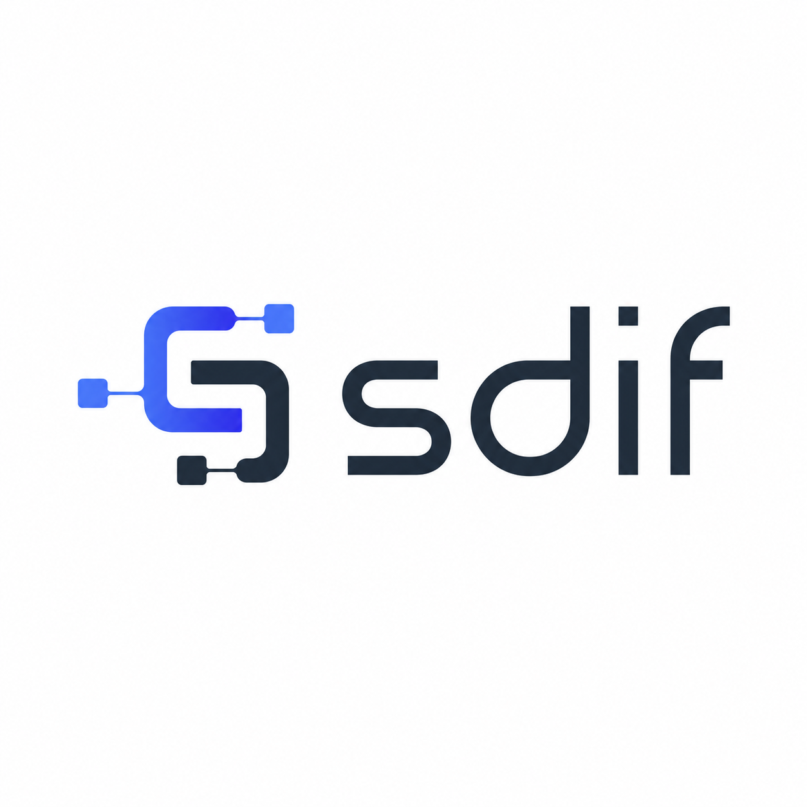

  

  <strong>Semantic Data Interchange Format</strong> 
  Compact, semantic and canonicalizable structured data for AI agents, deterministic workflows and human-auditable records.

---

We are building **SDIF — Semantic Data Interchange Format**: a compact, semantic and canonicalizable data format designed for AI agents, deterministic workflows and human-auditable structured data.

SDIF started from a simple problem: modern software systems are exchanging more and more structured context, but the formats we usually rely on were not designed for today’s AI-assisted, token-sensitive and verification-driven workflows.

JSON is everywhere, and it is excellent for machines, but it becomes verbose when repeated records matter.  
YAML is readable, but often too permissive for deterministic pipelines.  
CSV is compact, but loses structure and meaning too quickly.  
Markdown is human-friendly, but not enough when data needs to be parsed, validated, hashed or exchanged safely.

SDIF tries to sit in that gap.

Not as “yet another format”, but as a practical layer for data that needs to be:

- compact enough for AI context windows;
- structured enough for machines;
- readable enough for humans;
- deterministic enough for hashing, signing and reproducible workflows;
- semantic enough to express tables, relations, metadata and intent.

## Why we care

AI systems are becoming part of real development, analysis, planning and decision workflows. That means the data we pass between humans, tools and agents needs to be clearer, smaller and easier to verify.

We believe structured data should not force teams to choose between readability and determinism.

SDIF is our attempt to make structured information feel closer to a document, while still behaving like a contract.

## What SDIF is for

SDIF is especially useful for cases where data is not just stored, but exchanged, reviewed, compressed, validated or interpreted by software and AI systems.

Some examples:

- benchmark reports;
- project plans and roadmaps;
- structured specifications;
- agent memory snapshots;
- workflow state;
- registries and manifests;
- semantic datasets;
- canonical records for hashing or comparison;
- AI-friendly summaries of larger documents.

The goal is not to replace every format.  
The goal is to make certain classes of structured information easier to move, inspect and trust.

## Design principles

We are designing SDIF around a few clear principles:

### Compact by default

Repeated structure should not require repeated noise. SDIF aims to reduce unnecessary tokens and bytes while keeping the document understandable.

### Human-auditable

A developer, analyst or reviewer should be able to open an SDIF file and understand what is going on without a dedicated visual tool.

### Canonicalizable

The same data should be able to produce deterministic bytes when needed. This matters for hashing, signing, reproducibility and safe comparison.

### Semantic

Data is more than rows and fields. SDIF supports the idea that records can have relationships, meaning and context.

### AI-friendly

The format is being shaped with language models in mind: token efficiency, clarity, stable structure and low ambiguity are core concerns.

### Practical first

We are not trying to design a perfect academic format. We are building something useful, testable and honest enough to survive real workflows.

## Current status

SDIF is currently moving toward a stable **v1.0 specification**.

The project is still evolving, but the direction is clear:

- define the core syntax;
- stabilize canonicalization rules;
- improve JSON ↔ SDIF conversion;
- provide reliable tooling;
- publish meaningful benchmarks;
- document real-world use cases;
- keep the format small, understandable and implementable.

We prefer evidence over claims, so benchmarks and reproducible examples are an important part of the project.

## Repositories

This organization will host the official SDIF specification, reference tooling, examples, benchmarks and related documentation.

As the ecosystem grows, we expect to separate things clearly:

- specification;
- parser and canonicalizer;
- CLI tooling;
- benchmark suites;
- examples and golden files;
- documentation and website assets;
- integrations.

## A note on positioning

SDIF is not trying to be a replacement for JSON, YAML, CSV, Markdown or Parquet.

Those formats are good at what they were built for.

SDIF is focused on a narrower problem: compact, semantic, canonicalizable structured data that can move cleanly between humans, machines and AI systems.

That focus is intentional.

## Contributing

We are still early, so the most valuable contributions are not only code.

Useful contributions include:

- testing the format with real datasets;
- finding ambiguous syntax or edge cases;
- comparing SDIF against existing formats;
- improving documentation;
- suggesting practical use cases;
- challenging assumptions;
- building small tools around the format.

Good criticism is welcome. Vague hype is less useful.

## Project philosophy

We want SDIF to be boring in the best possible way.

Clear syntax.  
Small files.  
Stable output.  
Readable examples.  
Useful errors.  
Benchmarks that can be reproduced.  
A specification that does not require heroics to implement.

If SDIF works, it should feel obvious after you use it.

## License

SDIF is intended to be developed openly.

Licensing details may vary by repository, but the goal is to keep the core format and reference tooling accessible for developers, researchers and teams building AI-native workflows.

## Contact

For now, the best place to follow the project is through this GitHub organization.

More documentation, examples and public materials will be added as the v1.0 specification stabilizes.
